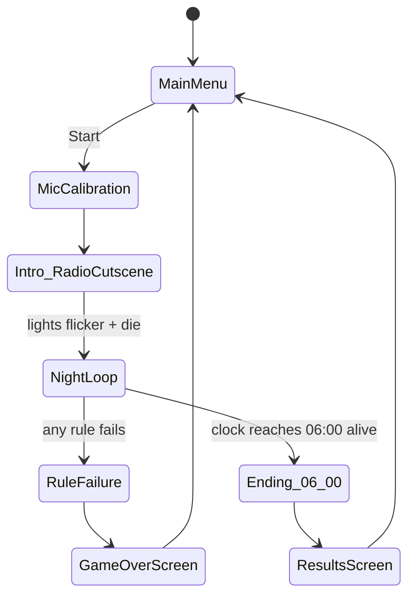
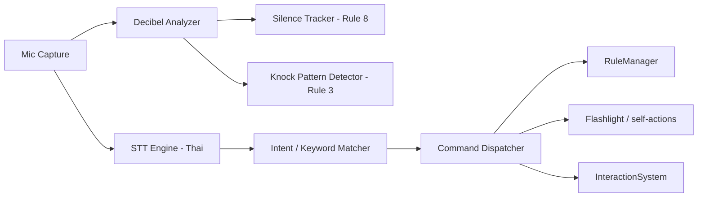
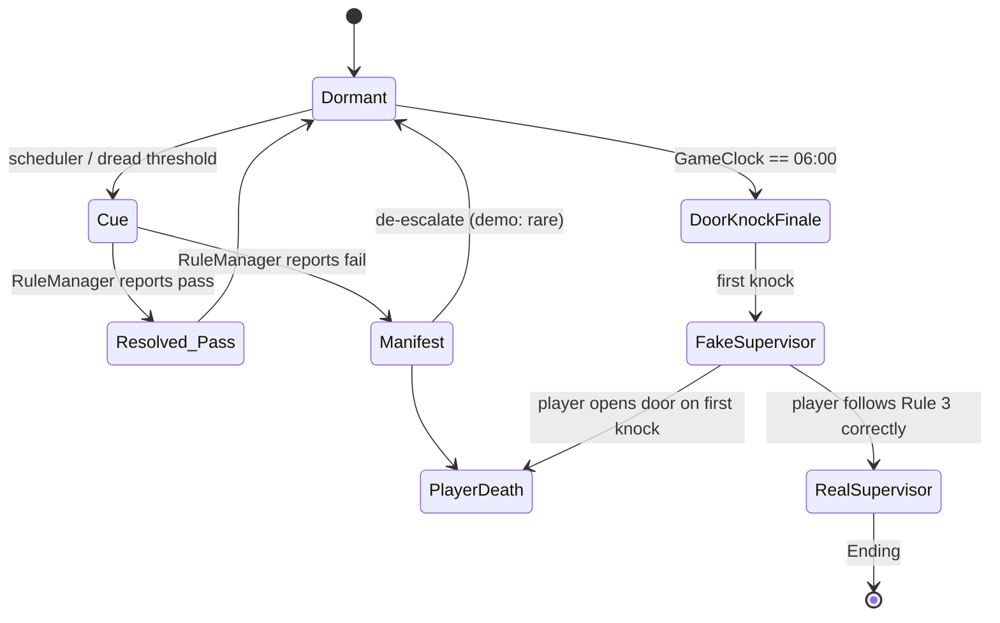

# Trust Me (คำสั่งตาย) — Demo Architecture & Systems Design

Scope: single-map night-shift horror demo, Thai-only STT, voice-only rule compliance, built on the existing Godot 4.7 / Jolt / Forward+ prototype (`Test/Test.tscn`, `player/player.tscn`).

---

## 0. Reconciling the Vision (read this first)

Two things in the source material point in different directions, and the demo has to pick one:

- **Proposal (3.2, 4, 6.3)** frames the core hook as: player is *not* the one walking around. They watch a limited, camera-grid-style feed (à la "คนอวดผี") and issue **voice commands to an NPC** who can't be seen directly. Limited perception is the whole point.
- **`Level_design.md` + current project** describe a **solo first-person survivor** (all 20 coworkers quit, "เหลือแค่เรา") who personally walks the factory, finds fuses, cleans blood, etc. — using the WASD controller that's already built.

These are not the same game. For a ~7-week demo (Aug 20 – Oct 7 per the proposal's own timeline), building a second camera-grid perception layer *and* a full NPC-command AI on top of the existing FPS controller is not achievable at demo quality.

**Recommended demo resolution:** keep the first-person survivor as the playable body (it's already built), and satisfy "voice is the only way to issue in-game actions, no NPC" by treating **the player's own supernatural-rule responses** as the commands — chanting, staying silent, knocking back, refusing to answer — spoken into the mic, not clicked. The literal camera-grid/NPC-command mode becomes a **post-demo stretch goal**, optionally teased in the demo as a single scripted CCTV monitor prop the player glances at, not a control scheme.

Flag this to the team/advisor explicitly — it changes what Objective 3.2 (limited-perception interface) can honestly claim to test in the demo.

---

## 1. Design Pillars

| Pillar | What it means for the demo |
|---|---|
| Voice is the input, not a gimmick | Every rule-response has no keyboard/UI fallback. Silence, correct speech, and controlled noise are the verbs. |
| Obedience under uncertainty | Player never gets full information (dim flashlight, radio static, partial rules). Rules are given up front but their *triggers* are diegetic and easy to miss. |
| One bad night, one map | No meta-progression needed for demo. Success = surviving 00:00→06:00 once. |
| Compliance ≠ passive | Following a rule should require correct, timed voice action (recite, go silent, knock 3x) — not just "don't press a button." |

---

## 2. Demo Scope — Cut List

In scope (matches proposal §6 + current repo gaps):

- 1 map (`Test`/factory scene, built out from current floor+player stub)
- Thai-only STT, single night cycle 00:00–06:00 compressed to real time
- All 8 rules from `Level_design.md` implemented as monitorable systems
- Fuse collection (×4), wrench fetch, machine "repair" beat, blood cleanup, delivery/storage beat, 04:00 fridge ritual, 06:00 door-knock ending
- One ghost entity (long-haired woman), one ending (survive vs. rule-break death)

Explicitly cut from demo:

- CCTV-grid / NPC-command interface (see §0)
- Multiple maps, multiple nights, meta-progression, save system
- Multiple ghosts/endings, branching narrative
- Controller/keyboard command fallback for rule actions (proposal forbids this anyway)
- Full NLU — voice commands are matched by **keyword/fuzzy intent matching**, not open dialogue

---

## 3. High-Level Game Flow



`MicCalibration` is a small but important addition not in the source docs: a 10-second "say something / stay quiet" step to set the player's personal noise floor before Rule 8 (30s silence) and Rule 3 (knock detection) can be calibrated reliably.

---

## 4. Core System Modules (Autoloads / Managers)

| Module | Responsibility |
|---|---|
| `GameClock` | Drives in-game time 00:00→06:00, fires hour-tick signals that the `EventScheduler` listens to. Configurable time compression (e.g. 1 real min = 1 in-game hour for demo pacing). |
| `EventScheduler` | Maps game-hour → story/objective beat (§5). Purely data-driven so hours/beats can be re-tuned without touching other systems. |
| `RuleManager` | Central compliance engine (§6). Owns the 8 rule contracts, arms/resolves them, applies consequences. |
| `VoiceInputManager` | Mic capture → decibel analysis → STT → intent parsing → dispatch (§7). |
| `LightingSystem` | Global light state: Normal / Flicker / Blackout / DeadBulbZones. Drives Rules 1, 2, 6. |
| `GhostAI` | State machine for the entity: Dormant, Cue (knock/cry/name-call), Manifest, DoorKnockFinale (§9). |
| `ObjectiveTracker` | Current active objective(s) + completion state (fuses found, wrench held, etc.), feeds minimal HUD. |
| `InteractionSystem` | Builds on the existing forward `RayCast3D` on the player for pickups/use-prompts. |
| `AudioDirector` | Ambient bed, stingers, and routes GhostAI cue audio at correct 3D positions (also read by `VoiceInputManager`'s decibel analyzer so it can tell ambient/game audio apart from mic input). |
| `SaveState` (minimal) | Not persistent for demo — in-memory only, resets on restart. |

---

## 5. Night Timeline / Event Scheduler

Directly ports `Level_design.md`'s hour beats, with the two blank slots (`04:00`, `05:00`) resolved:

| Hour | Beat | Primary system(s) | Notes |
|---|---|---|---|
| 00:00 | Radio call from boss (cutscene), lights flicker then die | `EventScheduler`, `LightingSystem`, `AudioDirector` | Ends in Blackout → arms Rule 1 immediately as a soft tutorial. |
| 12:00 (game-midday marker in doc, treat as first main objective) | Power restore: find 4 fuses across map, then check employee break room | `ObjectiveTracker`, `InteractionSystem`, `LightingSystem` | Flashlight-on exploration; teaches Rule 6 (dead-bulb zones) opportunistically. |
| 01:00 | Machine check → fetch wrench from break room | `InteractionSystem`, `ObjectiveTracker` | Establishes "you are alone" beat via environment storytelling (lockers, notes). |
| 02:00 | Delivery arrives (body parts) → player stores them | `InteractionSystem`, `AudioDirector` | First strong horror beat; good spot to also trigger Rule 2 (flicker → chant) as a scare. |
| 03:00 | Clean blood off machines | `InteractionSystem` | Low-tension breather before 04:00 ritual. |
| **04:00** *(resolved from blank)* | Fridge ritual: take meat to marked spot, call out using the given note; if note missing, must search for it first | `RuleManager` (Rule 5), `InteractionSystem`, `VoiceInputManager` | Directly matches Rule 5's "ตอนตี4" timing — this *is* the 04:00 beat, not a separate one. |
| **05:00** *(resolved from blank)* | No new mechanic — escalation beat: increase ambient dread, raise chance of Rule 3/4/7 cues firing, no new objective | `GhostAI`, `AudioDirector` | Recommend leaving this as a pure tension ramp for demo; flag to narrative team as open if they want a scripted beat later. |
| 06:00 | Knock at the door — first knock is the ghost impersonating the supervisor, second is real | `GhostAI` (DoorKnockFinale), `RuleManager` (Rule 3 interacts here) | Ending trigger — see §13. |

---

## 6. Rule / Compliance Engine

Each of the 8 rules is modeled as a **Rule Contract**: `trigger source → armed window → expected voice response → pass/fail check → consequence`.

| # | Rule (source) | Trigger | Armed by | Pass condition | Fail consequence |
|---|---|---|---|---|---|
| 1 | Lights die on their own → stay silent, no flashlight until they return | `LightingSystem.Blackout` | `RuleManager` | Decibel stays under noise-floor threshold AND flashlight stays off for full blackout duration | `GhostAI` escalates / instant death (demo: instant death, it's the clearest tutorial-of-consequence) |
| 2 | Lights flicker → recite the given chant | `LightingSystem.Flicker` | `RuleManager` arms response window (~8–10s) | `VoiceInputManager` STT keyword-matches enough of the chant within window | Manifest event / dread spike (forgiving in demo — not instant death, to avoid punishing STT misfires) |
| 3 | Three knocks heard → don't open door, knock back three times | `GhostAI.KnockCue` | `RuleManager` | `KnockPatternDetector` (decibel-peak counter) detects 3 spikes within window, AND door-open action is locked out during window | Door forced open by entity / death |
| 4 | Someone calls your name → never answer | `GhostAI.NameCallCue` | `RuleManager` | No matching response phrase detected by STT within window (silence or unrelated speech = pass) | Manifest / death |
| 5 | 04:00 fridge ritual, call using the note (find it if missing) | `GameClock` hour-tick | `RuleManager` + `ObjectiveTracker` | Item placed at marked spot AND STT matches the note's call-phrase | Ritual fails silently → escalates 05:00 dread ramp |
| 6 | Never walk through a dead-bulb area | `LightingSystem.DeadBulbZone` (tagged `Area3D`s) | `RuleManager` passive monitor | Player capsule never overlaps a tagged zone | `GhostAI` chase/kill triggered on entry |
| 7 | Crying heard → return to break room until it stops | `AudioDirector.CryCue` | `RuleManager` | Player position inside break-room volume for the cue's full duration | Death if player leaves early or approaches the cry source |
| 8 | Never be silent for 30+ seconds | Continuous | `SilenceTracker` (always active) | Decibel sample above threshold at least once per rolling 30s | "Something else" makes noise instead → scripted `GhostAI` audio cue (escalation, not necessarily instant death) |

Architecture notes:

- All rules subscribe to a shared **EventBus** (signals only, no polling loops across systems) so `RuleManager` doesn't need direct references into `LightingSystem`/`GhostAI`/`VoiceInputManager`.
- Rules 1, 6, 8 are **passive/continuous monitors**; Rules 2, 3, 4, 5 are **armed windows** with a timeout.
- Keep an explicit **Dread meter** (even if hidden from UI) so near-misses (STT almost matched the chant, silence at 27s) can escalate `GhostAI` aggression gradually rather than every fail being an instant hard cut — makes STT unreliability survivable instead of feeling unfair.

---

## 7. Voice & Audio Input Pipeline



- **Decibel Analyzer**: continuous amplitude sampling, calibrated per-player during `MicCalibration`. Feeds Silence Tracker and Knock Pattern Detector independently of STT — these two must work **without** waiting on STT round-trip latency, since timing (30s, 3 knocks) is strict.
- **STT Engine**: per proposal's tool list (Whisper / Azure Speech, etc.) — treat as an external service behind an interface so the engine is swappable without touching `RuleManager` or `InteractionSystem`. Push-to-talk vs. always-listening is an open decision (see §14) — always-listening is more diegetic but costs more API calls and raises false-positive risk on Rule 4 (must-not-respond).
- **Intent Matcher**: for demo, a small fixed **keyword/fuzzy-match dictionary** (chant phrase, ritual call phrase, self-action commands like "เปิดไฟฉาย") — not full NLU. Keeps STT accuracy risk contained.
- **Command Dispatcher**: routes matched intents only to the systems that need them; `RuleManager` and `PlayerController`/`InteractionSystem` never talk to STT directly.

---

## 8. Lighting / Perception System

- `LightingSystem` owns a single global state enum: `Normal / Flicker / Blackout`, plus a set of `Area3D`-tagged `DeadBulbZone` regions authored per-room in the level.
- Flashlight is a `PlayerController`-owned spotlight, but its *availability* is gated by `LightingSystem` during Blackout (Rule 1) — the system, not the player input, disables it, so a player instinctively hitting a flashlight key/voice-command during blackout is blocked rather than crashing the rule check.
- This is the closest demo equivalent to the proposal's "limited perception" objective: perception is throttled through light state and flashlight cone rather than a camera grid (see §0).

---

## 9. Ghost AI



`Cue` is a generic state parameterized by which rule it's servicing (knock / name-call / cry / flicker) so one state machine drives Rules 2, 3, 4, 7 rather than four separate AI scripts. `DoorKnockFinale` reuses the same Rule 3 knock-pattern logic but gates the ending instead of a mid-night death.

---

## 10. Interactables & Objectives

Built on the existing forward `RayCast3D` + prop scenes already in the repo (`Box`, `Wrench`, `Fuse`):

| Item/Action | Objective tie-in | Notes |
|---|---|---|
| Fuse ×4 (`Fuse.tscn`) | 12:00 beat | `ObjectiveTracker` counts collected/4; last one restores power → transitions `LightingSystem` out of the intro blackout. |
| Wrench (`Wrench.tscn`) | 01:00 beat | Fetched from break room, used at a machine interact-point. |
| Delivered item (body parts, new prop needed) | 02:00 beat | Carry-and-place interaction at a designated storage point. |
| Blood decals on machines | 03:00 beat | "Clean" interact prompt via `InteractionSystem`; needs a cleaning-tool prop or hold-to-clean interaction. |
| Meat + note | 04:00 / Rule 5 | Fridge pickup → carry to marked spot → voice call phrase. Note may be **missing on spawn**, forcing a short search sub-objective before the ritual can complete. |

All of these are new content on top of the current repo (only `Box`, `Wrench`, `Fuse` static props currently exist; the factory GLB isn't wired into the main scene yet — this is the main asset-integration work item).

---

## 11. UI/UX

Kept deliberately minimal/diegetic, consistent with "voice only, no buttons":

- Clock as a physical prop in the world (wall clock / radio display) rather than HUD text, if achievable in time; HUD fallback clock acceptable for demo.
- A small unobtrusive mic-level indicator (bar or dot) so players understand the game is listening — critical for a mechanic this unfamiliar.
- No rule checklist on-screen during play (rules are given once, up front, per the "trust me" premise) — but the **rules screen itself** (pre-game) should be a clean, readable list state, since it's the entire tutorial.

---

## 12. Godot Project Architecture Mapping

Additions to the current structure (`CURRENT_PROJECT_OVERVIEW.md` baseline):

```
res://
├── autoload/
│   ├── game_clock.gd          (Autoload)
│   ├── event_scheduler.gd     (Autoload)
│   ├── rule_manager.gd        (Autoload)
│   ├── voice_input_manager.gd (Autoload)
│   ├── lighting_system.gd     (Autoload)
│   ├── ghost_ai.gd            (Autoload)
│   └── objective_tracker.gd   (Autoload)
├── player/                    (existing — player.tscn, player.gd, camera_controller.gd)
│   └── interaction_component.tscn   (new — wraps existing forward RayCast3D)
├── Test/                      (existing — becomes the demo's single night map)
│   └── Night.tscn             (renamed/expanded from Test.tscn once factory GLB is wired in)
├── entities/
│   └── ghost/                 (ghost mesh/anim + Cue-state audio hookups)
├── Asset/                     (existing — Box, Wrench, Fuse; add delivery prop, note prop)
├── ui/
│   ├── rules_screen.tscn
│   ├── mic_level_indicator.tscn
│   └── clock_display.tscn
└── audio/
    ├── ambient/
    └── ghost_cues/
```

Signals flow strictly **up into autoloads, not sideways between scene-local scripts** — e.g. `player.gd` never calls `ghost_ai.gd` directly; it emits into the EventBus/autoload layer that `RuleManager`/`GhostAI` listen on. Keeps every system swappable (important given STT engine choice is still open).

---

## 13. Win / Loss Structure (Demo)

- **Loss**: any hard-fail rule consequence (Rules 1, 3, 6, or a Manifest-escalated fail) → `GameOverScreen`, restart from `MainMenu`. Single generic death state is enough for demo; per-rule death flavor (different scare per rule) is a nice-to-have, not required.
- **Win**: `GameClock` reaches 06:00 with player alive → `DoorKnockFinale` → correct Rule 3 response → `RealSupervisor` → `ResultsScreen`. One ending only for demo, matching proposal scope.

---

## 14. Open Technical Decisions

| Decision | Options | Recommendation for demo |
|---|---|---|
| STT engine | Whisper (local/self-hosted) vs. Azure Speech (cloud) | Azure for demo speed/reliability on Thai; revisit Whisper for cost/offline later. |
| Listening mode | Always-on mic vs. push-to-talk | Always-on for immersion, but add a short cooldown after each STT call to avoid re-triggering on the game's own ambient audio (route `AudioDirector` output away from the mic-input channel, or use echo cancellation). |
| Rule 2/5 speech matching strictness | Exact phrase vs. fuzzy keyword | Fuzzy — Thai STT + horror-game stress speech will not be exact. |
| Instant-death vs. escalation per rule | All-instant vs. dread-meter escalation (§6) | Escalation for STT-dependent rules (2, 4, 5), instant for clearly-detectable ones (1, 3, 6) — protects against STT false negatives feeling unfair. |

---

## 15. Suggested Build Order (maps to proposal's own timeline)

1. `GameClock` + `EventScheduler` skeleton, hard-code the 7 beats as stubs.
2. `LightingSystem` (Normal/Flicker/Blackout) + wire to existing player flashlight.
3. `VoiceInputManager` decibel path only (Silence Tracker, Knock Detector) — get Rule 8 and Rule 3 provable before STT is even integrated.
4. STT integration + Intent Matcher — unlock Rules 2, 4, 5.
5. `GhostAI` Cue state machine wired to `RuleManager` outcomes.
6. Content pass: wire factory GLB into `Night.tscn`, place fuses/wrench/props, author dead-bulb zones.
7. `DoorKnockFinale` + ending screens.
8. UI pass (rules screen, mic indicator) + full playtest for pacing/timeline tuning.
